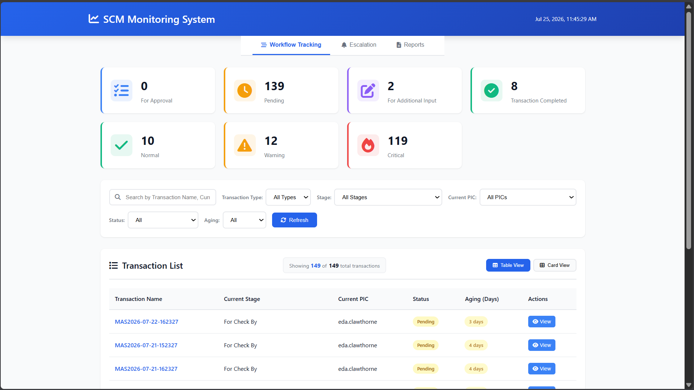
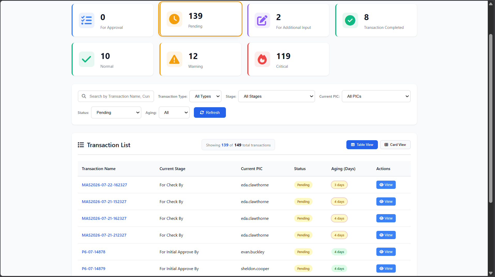
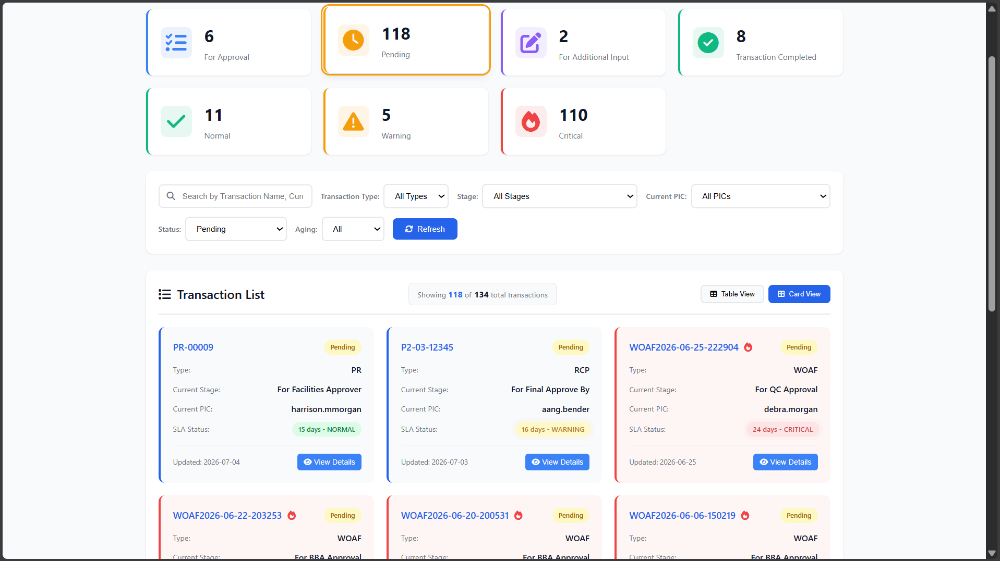
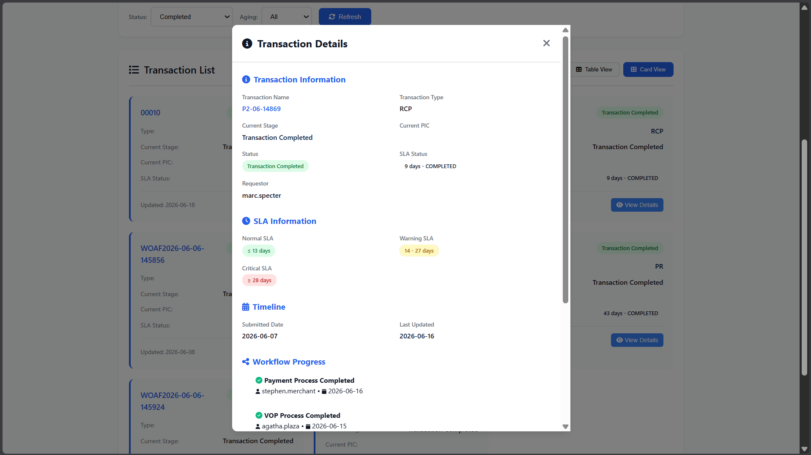
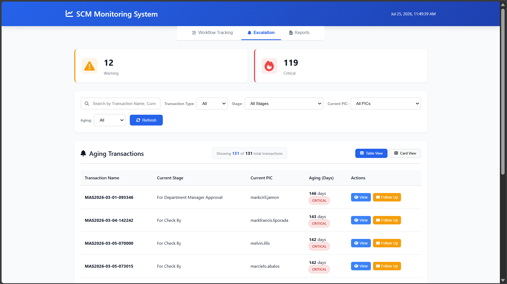
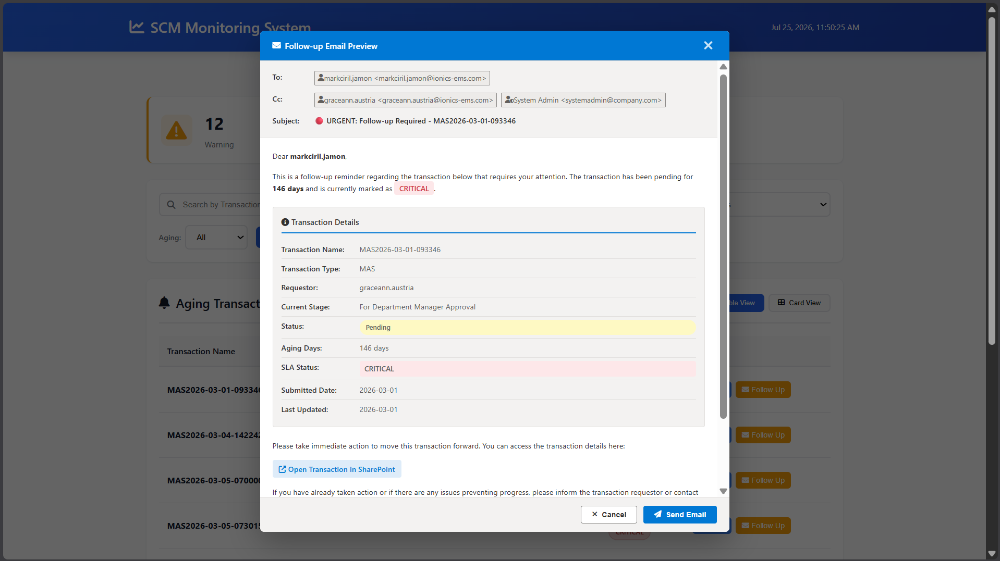
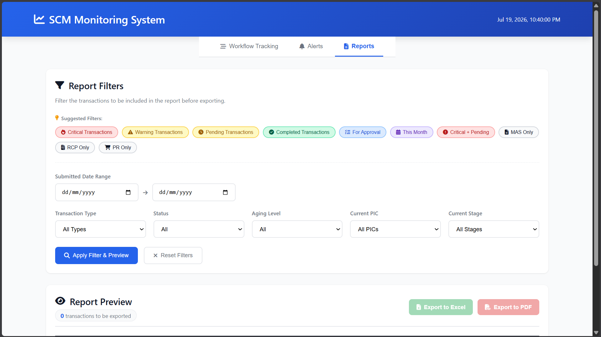
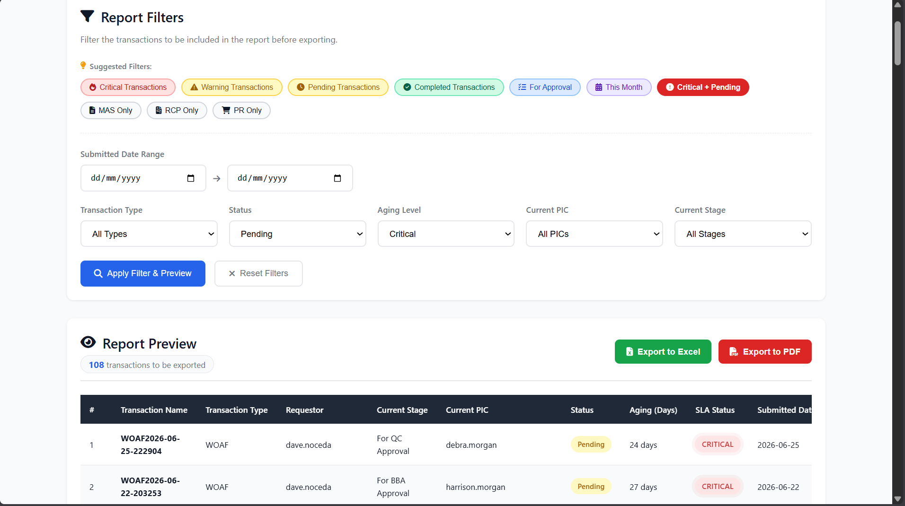
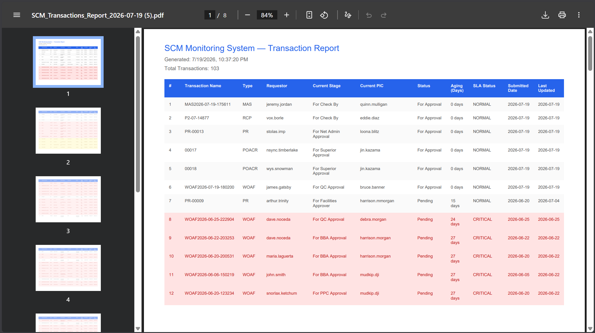
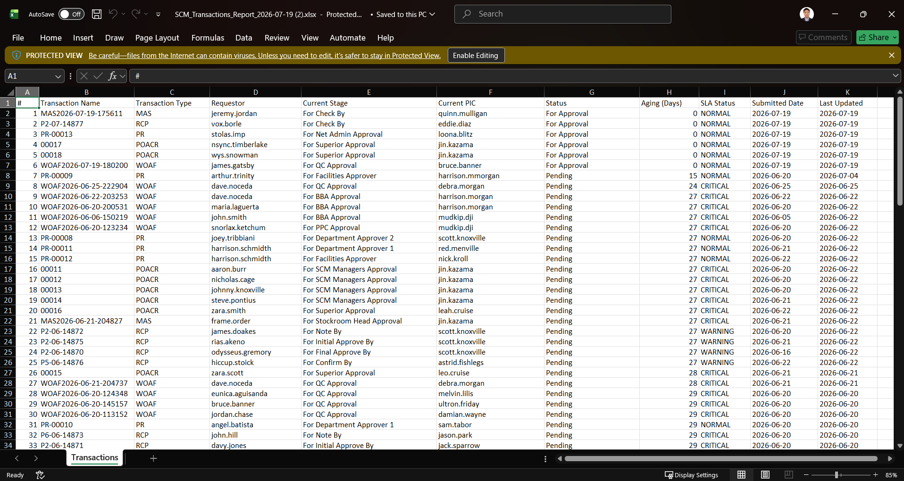

# SCM Monitoring System

A comprehensive web-based monitoring system for tracking supply chain management transactions, approval workflows, aging alerts, and automated escalation management.

## Overview

The SCM Monitoring System is designed to help organizations monitor transaction statuses, track approval stages, identify aging transactions, and manage escalations with simulated email notifications.

## Modules

### 1. Workflow Tracking Module
Monitor all transactions with comprehensive filtering, search, and real-time updates (30-seconds refresh).

### Dashboard Summary

> Summary cards showing transaction counts by status and aging level.

---

### Table View

> Transaction list in table format with status badges and aging indicators.

---

### Card View

> Transaction list in card format for easier visual scanning.

---

### Transaction Detail Modal

> Detailed view showing transaction info, SLA thresholds, and workflow timeline.

---

### 2. Escalation Module
Focus on Warning and Critical aging transactions with follow-up capabilities.
<!--<screenshots here>
### Escalation Module

> Escalation module focusing on Warning and Critical aging transactions with follow-up actions.

---

### Email Preview Modal

> Outlook-style email preview showing simulated follow-up email with transaction details.
-->

---
### 3. Reports Module
Generate, preview, and export filtered transaction reports to Excel or PDF.

### Reports Module

> Reports module with filters, preview, and export to Excel or PDF.

---

### Preset Filter Report

> Reports module showing preset filter options for quick common reports.

---

### PDF Export Report

> Reports module exported filtered data to PDF.

---

### Excel Export Report

> Reports module exported filtered data to Excel.

### Process Flow

```
SQL Server Database
        │
        │  pyodbc queries
        ▼
db_connection.py
        │
        │  returns data to API layer
        ▼
display_data_api.py  (Flask REST API — port 5000)
        │
        │  JSON responses
        ├─────────────────────────────────────────┬─────────────────────────────────────────┐
        ▼                                         ▼                                         ▼
workflow-tracking.html                      escalation.html                           reports.html
script.js                                   escalation.js                             reports.js
        │                                         │                                         │
        ├── loadAllTransactionsList()             ├── loadEscalationData()                  ├── loadReportData()
        ├── updateDashboardSummary()              ├── updateSummaryCards()                  ├── populateFilterDropdowns()
        ├── loadDistinctStages()                  ├── applyFilters()                        ├── applyReportFilters()
        ├── loadDistinctTransactionTypes()        ├── renderTransactions()                  ├── renderReportPreview()
        ├── loadDistinctCurrentPICs()             ├── openEmailPreviewModal()               ├── Suggested Filter Presets
        ├── applyFilters()                        ├── simulateSendEmail()                   ├── exportToExcel()
        ├── renderTransactions()                  └── updateMetric()                        └── exportToPDF()
        ├── detectNewCriticalTransactions()
        ├── showCriticalAlert() (toast)
        └── openTransactionModal()
                │
                ├── loadWorkflowProgress()
                └── loadSLAInformationDetails()

        Navigation
        ──────────
        workflow-tracking.html  ──[Escalation tab]──►  escalation.html
        workflow-tracking.html  ──[Reports tab]──►     reports.html
        escalation.html         ──[Workflow tab]──►    workflow-tracking.html
        escalation.html         ──[Reports tab]──►     reports.html
        reports.html            ──[Workflow tab]──►    workflow-tracking.html
        reports.html            ──[Escalation tab]──►  escalation.html
```
---

### Polling — Auto Refresh (every 30 seconds)

```
setInterval() ──► refreshCriticalCount()        ──► /api/critical-count
             ──► refreshWarningCount()          ──► /api/warning-count
             ──► refreshNormalCount()           ──► /api/normal-count
             ──► refreshForApprovalCount()      ──► /api/forApproval-count
             ──► refreshPendingCount()          ──► /api/pending-count
             ──► refreshForAdditionalInputCount() ──► /api/forAdditionalInput-count
             ──► refreshCompletedCount()        ──► /api/completed-count
```

---

### User Interaction Flow

```
User clicks "View" button
        │
        ▼
viewTransactionDetails(transactionId)
        │
        ├── Find transaction in currentTransactions[]
        ├── Find SLA info in slaInformationDetails[]
        ├── Filter workflow steps in allTransactionsWorkflowProgress[]
        │
        ▼
Render Modal with 4 sections:
        ├── 📋 Transaction Information  (name, type, stage, PIC, status)
        ├── 🕐 SLA Information          (normal / warning / critical thresholds)
        ├── 📅 Timeline                 (submitted date, last updated)
        └── 🔀 Workflow Progress        (step-by-step history with icons)
```

---

### SLA Aging Classification

```
agingDays from SQL
        │
        ▼
SLA Status (Aging Level)
        ├── 🟢 Normal   → within normal SLA days     → aging-normal  (green pill)
        ├── 🟡 Warning  → approaching SLA deadline    → aging-warning (yellow pill + pulse)
        └── 🔴 Critical → exceeded SLA deadline       → aging-critical (red pill + pulse animation)
```

---

### Escalation Email Flow

```
User clicks "Follow Up" button
        │
        ▼
openEmailPreviewModal(transaction)
        │
        ├── Extract transaction details
        ├── Populate email recipients (To: Current PIC, Cc: Requestor + System Admin)
        ├── Generate email subject with urgency label (🔴 URGENT / ⚠️ ATTENTION REQUIRED)
        ├── Create email body with transaction details, SLA status, and SharePoint link
        │
        ▼
Display Outlook-style Email Preview Modal
        │
        ├── User reviews email content
        ├── User clicks "Send Email"
        │
        ▼
simulateSendEmail()
        │
        ├── Show sending state (spinner animation)
        ├── Simulate API delay (1.5 seconds)
        ├── Close email preview modal
        └── Display success toast message
```

---

## Features

### 📊 Module 1: Workflow Tracking

#### Dashboard Summary
- **Active Transactions**: Real-time count of ongoing transactions (30-second refresh)
- **Completed Transactions**: Total completed transactions
- **Status Breakdown**: For Approval, Pending, For Additional Input counts
- **Aging Breakdown**: Normal, Warning, Critical counts
- **Clickable Cards**: Click any summary card to instantly filter the transaction list

#### Advanced Filtering & Search
- **Search**: Find transactions by ID, name, requestor, stage, PIC, or type
- **Status Filter**: Filter by For Approval, Completed, Pending, or For Additional Input
- **Aging Filter**: Filter by Normal, Warning, or Critical (based on SLA thresholds per transaction type)
- **Stage Filter**: Filter by workflow stage (Submission, Review, Approval, Processing, Completed)
- **Transaction Type Filter**: Filter by MAS, RCP, PR, WOAF, POACR
- **Current PIC Filter**: Filter by person currently responsible for the transaction

#### Dual View Modes
1. **Table View**: Comprehensive tabular display with all transaction details
2. **Card View**: Visual card-based layout for easier scanning

#### Workflow Tracking
- Visual timeline showing transaction progress through stages
- User and date tracking for each completed stage
- SharePoint link integration for direct access to transaction details

#### Aging Monitoring
- **Normal**: Green indicator (within SLA)
- **Warning**: Orange indicator with pulse animation (approaching SLA deadline)
- **Critical**: Red indicator with pulse animation (exceeded SLA deadline)

---

### ⚠️ Module 2: Escalation Management

#### Focus on Critical Transactions
- **Pre-filtered View**: Only displays Warning and Critical aging transactions
- **Summary Cards**: Quick counts of Warning vs Critical transactions
- **Clickable Cards**: Filter by Warning or Critical with one click

#### Follow-Up Email System
- **Simulated Email Sending**: No SMTP configuration required
- **Outlook-Style UI**: Professional email preview modal mimicking Microsoft Outlook
- **Auto-populated Recipients**:
  - **To**: Current PIC (person responsible for the transaction)
  - **Cc**: Requestor + System Admin
- **Smart Subject Lines**:
  - 🔴 URGENT for Critical transactions
  - ⚠️ ATTENTION REQUIRED for Warning transactions
- **Detailed Email Content**:
  - Professional greeting addressing the current PIC
  - Transaction details table (name, type, requestor, stage, status, aging, dates)
  - SLA status badge (Critical/Warning)
  - Direct SharePoint link for quick access

#### Email Preview Features
- **Review Before Sending**: Preview full email content before sending
- **Simulated Sending**: Shows loading state, then success confirmation
- **Button State Management**: Follow-up button changes to "Sent" after successful simulation
- **Toast Notifications**: Success message confirming email sent to recipients

#### Filtering Options
- **Search**: Find escalation transactions by name, requestor, stage, PIC, or transaction name
- **Aging Filter**: Filter by Warning or Critical
- **Stage Filter**: Filter by workflow stage
- **Transaction Type Filter**: Filter by transaction type
- **Current PIC Filter**: Filter by responsible person

#### Metrics Display
- **Transaction Counter**: Shows "Showing X of Y total transactions"
- **Dynamic Updates**: Counter updates as filters are applied

---

### 📈 Module 3: Reports

#### Report Generation
- **Date Range Filter**: Filter transactions by submitted date range
- **Multi-criteria Filtering**:
  - Transaction Type (MAS, RCP, PR, WOAF, POACR)
  - Status (For Approval, Pending, For Additional Input, Completed)
  - Aging Level (Normal, Warning, Critical)
  - Current PIC
  - Current Stage

#### Suggested Filter Presets
Quick-access filter combinations for common reports:
- **All Critical Aging Transactions**
- **All Warning Aging Transactions**
- **All Pending Transactions**
- **All For Approval Transactions**
- **Current Month Transactions**
- **All Completed Transactions**
- **All Critical Aging + Pending Transactions**
- **All MAS Transactions**
- **All PR Transactions**
- **All RCP Transactions**

#### Report Preview
- **Live Preview**: See filtered results before exporting
- **Record Count**: Displays number of matching transactions
- **Table Display**: Preview data in organized table format

#### Export Options
1. **Export to Excel (.xlsx)**
2. **Export to PDF (.pdf)**

---

## File Structure

```
scm-monitoring-system/
├── workflow-tracking.html    # Main dashboard — transaction list, filters, summary cards
├── escalation.html           # Escalation module — Warning/Critical transactions with follow-up
├── reports.html              # Reports module — filter, preview, and export transactions
├── styles.css                # Workflow Tracking and Reports styling
├── escalation.css            # Escalation module styling (includes email modal styles)
├── script.js                 # Workflow Tracking logic — API fetching, filtering, rendering, alerts
├── escalation.js             # Escalation logic — email preview, simulated sending, filtering
├── reports.js                # Reports logic — preset filters, preview, Excel/PDF export
├── display_data_api.py       # Flask REST API — exposes all endpoints on port 5000
├── db_connection.py          # Database layer — pyodbc SQL Server queries and connections
├── .env                      # Environment variables — DB credentials (never committed)
├── requirements.txt          # Python dependencies
├── docs/
│   └── screenshots/
│       ├── dashboard-summary.png
│       ├── pending-filter.png
│       ├── card-view-pending-filter.png
│       ├── transaction-modal.png
│       ├── escalation-module.png
│       ├── email-preview-modal.png
│       ├── reports-module.png
│       ├── preset-filter-report.png
│       ├── pdf-export-report.png
│       └── excel-export-report.png
└── README.md                 # Project documentation
```

---

## Technologies Used

### Frontend
- **HTML5**: Semantic markup and structure
- **CSS3**: Styling with flexbox, grid, CSS variables, animations, and transitions
- **JavaScript (ES6+)**: Dynamic functionality, API fetching, DOM manipulation, and state management
- **Font Awesome 6.4.0**: Icon library via CDN for UI icons (status badges, buttons, timeline icons, email icons)

### Backend
- **Python 3**: Server-side logic and database querying
- **Flask**: Lightweight web framework for REST API endpoints
- **Flask-CORS**: Cross-Origin Resource Sharing support to allow HTML files to call the Flask API
- **pyodbc**: Python library for connecting and querying the Microsoft SQL Server database
- **openpyxl**: Python library for generating Excel (.xlsx) files
- **reportlab**: Python library for generating PDF files

### Database
- **Microsoft SQL Server (MSSQL)**: Primary database storing all transaction data, views, and SLA information
- **T-SQL**: SQL queries and views used to retrieve transactions, counts, workflow progress, and SLA details

---

## Getting Started

### Prerequisites
- A modern web browser (Chrome, Firefox, Edge, Safari)
- Python 3.8+ installed on your machine
- Microsoft SQL Server with transaction data

### Installation

1. Clone or download the repository to your local machine
2. Navigate to the project directory
3. Install Python dependencies:

```bash
pip install -r requirements.txt
```

4. Create a `.env` file with your database credentials:

```env
DB_SERVER=your_server_name
DB_NAME=your_database_name
DB_USERNAME=your_username
DB_PASSWORD=your_password
```

### Running the Application

> ⚠️ **Important**: You must start the API server first before opening any HTML file.

**Step 1 — Start the API Server**

Open a terminal in the project directory and run:

```bash
python display_data_api.py
```

Wait until you see the server is running (e.g., `* Running on http://localhost:5000`).

**Step 2 — Open the Application**

Once the API server is running, open any HTML file in your browser:

```bash
# Open Workflow Tracking (Main Dashboard)
start workflow-tracking.html

# Or open Escalation Module
start escalation.html

# Or open Reports Module
start reports.html
```

**Step 3 — Navigate Between Modules**

Use the navigation tabs at the top to switch between modules:
- **Workflow Tracking**: View all transactions with comprehensive filtering
- **Escalation**: Focus on Warning/Critical transactions with follow-up actions
- **Reports**: Generate and export filtered transaction reports

**Step 4 — Stopping the Server**

When done, go back to the terminal running the API and press:

```
Ctrl + C
```

### Quick Start Summary

| Step | Command | Description |
|------|---------|-------------|
| 1 | `pip install -r requirements.txt` | Install dependencies |
| 2 | Create `.env` file | Configure database credentials |
| 3 | `python display_data_api.py` | Start the API server |
| 4 | Open `workflow-tracking.html` | Launch the application |
| 5 | Use navigation tabs | Switch between modules |
| 6 | `Ctrl + C` | Stop the API server when done |

---

## Usage

### Workflow Tracking Module

1. **View Dashboard** — Summary cards display key metrics by status and aging level
2. **Click Summary Cards** — Instantly filter the transaction list by clicking any card
3. **Search Transactions** — Use the search box to find specific transactions
4. **Apply Filters** — Use dropdown filters to narrow down results
5. **Switch Views** — Toggle between Table View and Card View
6. **View Details** — Click the "View" button to open the transaction detail modal
7. **Auto-Refresh** — Data refreshes automatically every 30 seconds

### Escalation Module

1. **View Warning/Critical Transactions** — Automatically filtered to show only escalated transactions
2. **Click Summary Cards** — Filter by Warning or Critical with one click
3. **Review Transaction Details** — Click "View" to see full transaction information
4. **Send Follow-Up Email**:
   - Click the "Follow Up" button on any transaction
   - Review the Outlook-style email preview
   - Check recipients (To: Current PIC, Cc: Requestor + System Admin)
   - Review email content with transaction details
   - Click "Send Email" to simulate sending
   - See success confirmation and button state change to "Sent"
5. **Track Sent Emails** — Buttons change to "Sent" state after simulation

### Reports Module

1. **Select Date Range** — Choose submitted date range for the report
2. **Apply Filters** — Use dropdown filters or click suggested preset filters
3. **Preview Results** — Review the filtered transactions in the preview table
4. **Export Report**:
   - Click "Export to Excel" for .xlsx file
   - Click "Export to PDF" for .pdf file
5. **Common Reports** — Use suggested filter presets for quick report generation:
   - All Critical Aging Transactions
   - All Warning Aging Transactions
   - All Pending Transactions
   - All For Approval Transactions
   - Current Month Transactions
   - All For Additional Input Transactions
   - All Completed Transactions
   - All Critical Aging + Pending Transactions
   - All MAS Transactions
   - All PR Transactions
   - All RCP Transactions

---

## Key Features Explained

### Transaction Status Badges
- **For Approval** (Blue): Updated within 24 hours, awaiting approval
- **Transaction Complete** (Green): Successfully approved and completed
- **Pending** (Orange): Awaiting approval, last updated >24 hours ago
- **For Additional Input** (Violet): Requires specific information from current approver

### Aging Indicators
The system automatically calculates aging based on submission date and transaction type SLA:
- **Normal** (Green): Within SLA threshold
- **Warning** (Yellow/Orange + Pulse): Approaching SLA deadline
- **Critical** (Red + Pulse): Exceeded SLA deadline

### Workflow Timeline
Each transaction has a detailed workflow timeline showing:
- All stages of the approval process
- Completion dates and responsible users
- Current stage with visual indicator
- Icons representing each stage type

### Email Preview System
- **No SMTP Required**: Simulated email sending for demonstration and testing
- **Outlook-Style Interface**: Professional email UI matching Microsoft Outlook
- **Smart Recipients**: Automatically populates To and Cc fields based on transaction data
- **Urgency Labels**: Subject line includes 🔴 URGENT or ⚠️ ATTENTION REQUIRED
- **Rich Email Content**: Includes all transaction details, SLA status, and direct links

### Pagination
- Displays 10 transactions per page
- Easy navigation with Previous/Next buttons
- Current page indicator and total pages

---

## API Endpoints

The Flask API (`display_data_api.py`) exposes the following endpoints:

| Endpoint | Method | Description |
|----------|--------|-------------|
| `/api/all-transactions-list` | GET | Returns all transactions with details |
| `/api/distinct-stages` | GET | Returns list of distinct workflow stages |
| `/api/distinct-transaction-types` | GET | Returns list of distinct transaction types |
| `/api/distinct-current-pics` | GET | Returns list of distinct current PICs |
| `/api/workflow-progress/<transaction_id>` | GET | Returns workflow timeline for a transaction |
| `/api/sla-information-details` | GET | Returns SLA thresholds for all transaction types |
| `/api/critical-count` | GET | Returns count of critical aging transactions |
| `/api/warning-count` | GET | Returns count of warning aging transactions |
| `/api/normal-count` | GET | Returns count of normal aging transactions |
| `/api/forApproval-count` | GET | Returns count of For Approval transactions |
| `/api/pending-count` | GET | Returns count of Pending transactions |
| `/api/forAdditionalInput-count` | GET | Returns count of For Additional Input transactions |
| `/api/completed-count` | GET | Returns count of Completed transactions |
| `/api/escalation-transactions` | GET | Returns Warning and Critical transactions |

---

## Performance

- **Lightweight**: Fast loading and smooth performance
- **Optimized**: Efficient data fetching and rendering
- **Pagination**: Handles large datasets with 10 items per page
- **Auto-Refresh**: Smart polling every 30 seconds without page reload
- **Smooth Animations**: CSS transitions and animations for better UX

---

## Accessibility

- **Semantic HTML**: Proper HTML5 structure
- **Keyboard Navigation**: Full keyboard support
- **Screen Reader Friendly**: ARIA labels and semantic elements
- **High Contrast**: Clear visual indicators and readable color scheme
- **Responsive Design**: Works on all screen sizes

---

## Browser Compatibility

Tested and working on:
- Google Chrome (recommended)
- Microsoft Edge
- Mozilla Firefox
- Brave

---

## Future Enhancements

Planned features for future releases:
- **Real SMTP Integration**: Replace simulated emails with actual email sending
- **Email Templates**: Customizable email templates for different scenarios
- **Advanced Analytics**: Charts and graphs for transaction trends
- **Mobile App**: Native iOS and Android applications
- **User Management**: Role-based access control
- **Audit Trail**: Complete history of all actions and changes
- **Batch Operations**: Bulk actions on multiple transactions
- **Custom Reports**: User-defined report templates
- **Dashboard Widgets**: Customizable dashboard layout

---

## Troubleshooting

### API Server Won't Start
- Check if port 5000 is already in use
- Verify Python dependencies are installed: `pip install -r requirements.txt`
- Check `.env` file has correct database credentials

### Data Not Loading
- Ensure API server is running before opening HTML files
- Check browser console for error messages (F12)
- Verify database connection in `db_connection.py`

### Email Preview Not Opening
- Check browser console for JavaScript errors
- Ensure `escalation.js` is loaded correctly
- Verify `emailPreviewModal` element exists in HTML

### Export Not Working
- Ensure API server has write permissions
- Check browser console for errors
- Verify `openpyxl` and `reportlab` are installed

---

## License

This project is part of the SCM Monitoring System. All rights reserved.

---

## Support

For questions or issues, please contact the development team.

---

## Version History

### v1.0.0 — Initial Release
- Initial release of SCM Monitoring System
- Workflow tracking dashboard with transaction list
- Table view and card view toggle
- Basic search and filter functionality
- Transaction detail modal with workflow timeline
- SLA threshold monitoring per transaction type
- Dashboard summary cards showing status and aging level counts
- Flask REST API connected to SQL Server via pyodbc
- Environment variable configuration for database credentials

### v1.1.0 — Aging & Filter Improvements
- Added aging computation logic per transaction type (MAS, RCP, PR, WOAF, POACR)
- Fixed aging days for completed transactions — now shows closed duration (submitted → last modified)
- Fixed `CROSS APPLY` to `OUTER APPLY` to include transactions with 0 aging days
- Added `Normal` threshold status for transactions submitted on the same day
- Added requestor field to wildcard search
- Dashboard summary cards are now clickable — act as quick filters for the transaction list
- Added transaction count metric — displays `Showing X of Y total transactions`

### v1.2.0 — Reports Module
- Added Reports module (`reports.html`, `reports.js`)
- Reports module includes filters by date range, type, status, aging level, PIC, and stage
- Added suggested filter presets for quick common report exports
- Export to Excel (`.xlsx`) and Export to PDF (`.pdf`)
- Fixed submitted date range UI overlap in Reports module
- Updated navigation — Reports tab routes to `reports.html`

### v1.3.0 — Escalation Module & Email Simulation (Current)
- **Added Escalation Module** (`escalation.html`, `escalation.css`, `escalation.js`)
- **Email Preview System**: Outlook-style email preview modal
- **Simulated Email Sending**: No SMTP configuration required
- **Auto-populated Recipients**: To (Current PIC), Cc (Requestor + System Admin)
- **Smart Subject Lines**: Urgency labels (🔴 URGENT / ⚠️ ATTENTION REQUIRED) based on aging level
- **Rich Email Content**: Transaction details, SLA status badges, SharePoint links
- **Button State Management**: Follow-up buttons change to "Sent" after simulation
- **Pre-filtered View**: Escalation module shows only Warning and Critical transactions
- **Clickable Summary Cards**: Filter by Warning or Critical with one click
- **Transaction Counter**: Shows filtered count vs total count
- **Delegated Event Handling**: Clean button architecture without inline onclick
- **Toast Notifications**: Success messages for simulated email sends
- **Navigation Updates**: All three modules now interconnected with navigation tabs

---

**Last Updated**: July 2026  
**System Version**: v1.3.0